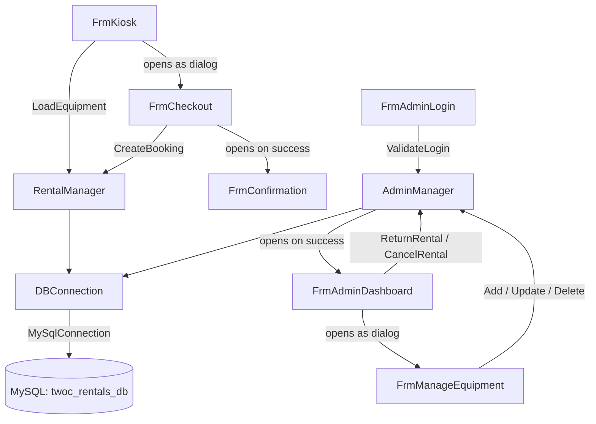

<div align="center">

<h1>Equipment Rental System</h1>

<em>A Windows desktop kiosk and admin portal for equipment rental businesses — built with VB.NET, Windows Forms, and MySQL.</em>

[](https://dotnet.microsoft.com/)
[](https://dotnet.microsoft.com/)
[](https://www.mysql.com/)
[](https://www.microsoft.com/windows)

<br/>

[](https://dotnet.microsoft.com/)
[](https://www.mysql.com/)
[](https://git-scm.com/)
[](https://visualstudio.microsoft.com/)

</div>

---

## Overview

**2C Rentals** is a Windows Forms desktop application built for small equipment rental businesses. It provides a self-service customer kiosk where patrons can browse available gear, build a cart, and complete a booking — all without staff involvement. A separate, password-protected admin portal gives staff tools to manage the equipment catalog, monitor active and overdue rentals, and process returns or cancellations with automatic stock restoration.

**Core features:**

- **Self-service kiosk** — customers browse equipment cards by category, set quantities and rental days, and check out independently via `FrmKiosk` → `FrmCheckout` → `FrmConfirmation`
- **Atomic bookings with oversell protection** — a single MySQL transaction inserts the customer, rental header, and all line items, then decrements stock with a row-count guard that rolls back if stock is insufficient
- **Auto-generated booking codes** — unique `BK-YYYYMMDD-NNNN` identifiers are assigned at booking time and displayed on the confirmation screen
- **Admin dashboard with live stats** — active rentals, overdue count, and today's bookings are recalculated on every dashboard open; overdue detection requires no scheduled job
- **Equipment CRUD with soft-delete** — admin staff can add, update, and deactivate equipment without orphaning historical rental records
- **Secure password authentication** — admin passwords are stored and compared as SHA-256 hex digests; plaintext is never persisted to disk or the database

---

## Tech Stack

| Technology                                | Version          | Category  | Purpose                                              |
|-------------------------------------------|------------------|-----------|------------------------------------------------------|
| VB.NET                                    | —                | Language  | Application language                                 |
| .NET                                      | 10.0-windows     | Framework | Runtime, SDK, and WinForms host                      |
| Windows Forms                             | built-in         | UI        | Desktop GUI layer — forms, panels, and controls      |
| MySQL Server                              | 8.0+             | Database  | Persistent store — schema `twoc_rentals_db`          |
| MySql.Data                                | 9.6.0            | DB Driver | ADO.NET connector used by all SQL operations         |
| System.Configuration.ConfigurationManager | 9.0.4            | Config    | Reads the connection string from `App.config`        |
| System.Security.Cryptography              | built-in         | Security  | SHA-256 password hashing via `HashHelper`            |

---

## File & Directory Structure

```
Equipment-Rental-System/
+-- ERS.slnx                          # Visual Studio solution file
\-- ERS/
    +-- App.config                     # DB connection string (key: TwoCRentals)
    +-- ERS.vbproj                     # SDK-style project -- target framework + NuGet refs
    +-- setup_database.sql             # Schema creation + seed data (run before first launch)
    |
    +-- [Data Models]
    +-- EquipmentItem.vb               # POCO: equipment fields + IsAvailable computed property
    +-- CartItem.vb                    # POCO: EquipmentItem ref, quantity, LineTotal()
    |
    +-- [Data / Service Layer]
    +-- DBConnection.vb                # Factory: returns MySqlConnection from App.config
    +-- HashHelper.vb                  # Utility: SHA-256 hex-string computation
    +-- RentalManager.vb               # Customer-facing ops: LoadEquipment, CreateBooking
    +-- AdminManager.vb                # Admin ops: auth, dashboard stats, rental CRUD, equipment CRUD
    |
    +-- [Customer Forms]
    +-- FrmKiosk.vb                    # Equipment browser -- cards, category filter pills, cart sidebar
    +-- FrmKiosk.Designer.vb           # Designer-generated partial class for static controls
    +-- FrmCheckout.vb                 # Collects customer name, contact, and rental date range
    +-- FrmConfirmation.vb             # Booking-confirmed dialog -- displays booking code and total
    |
    +-- [Admin Forms]
    +-- FrmAdminLogin.vb               # Username/password entry, SHA-256 verified against DB
    +-- FrmAdminDashboard.vb           # Stats cards + rentals DataGridView + Return/Cancel buttons
    +-- FrmManageEquipment.vb          # Add, update, and soft-delete equipment inventory
    |
    \-- My Project/
        \-- Application.myapp          # WinForms startup configuration (startup form: FrmKiosk)
```

**Key directories and why the project is structured this way:**

- **Data/service layer** (`DBConnection`, `RentalManager`, `AdminManager`, `HashHelper`) — all SQL is isolated here. Form code never builds connection strings or constructs queries, keeping the UI layer free of database logic and making queries easy to audit and modify.
- **Data models** (`EquipmentItem`, `CartItem`) — dependency-free VB POCOs passed between the service layer and forms as strongly typed containers, avoiding `DataRow` casts in UI code.
- **Customer forms** (`FrmKiosk` → `FrmCheckout` → `FrmConfirmation`) — a linear dialog wizard. Each form is opened as a child dialog by the preceding one, keeping navigation state minimal and the flow unambiguous for customers using the kiosk.
- **Admin forms** (`FrmAdminLogin` → `FrmAdminDashboard` → `FrmManageEquipment`) — a separate flow launched via **F12** from anywhere on the kiosk, providing a clean separation between the public-facing and staff-facing surfaces of the application.

---

## Architecture & How the Code Works Together

The project uses a **three-layer Windows desktop architecture**: Forms (UI) → Service classes (business logic) → DBConnection factory (data access) → MySQL.

**Customer booking path:**
> `FrmKiosk` loads equipment via `RentalManager.LoadEquipment()` → customer adds items to the in-memory `List(Of CartItem)` → clicks **Checkout** → `FrmCheckout` collects name, contact, and date range → calls `RentalManager.CreateBooking()` → a single MySQL transaction inserts `customers`, `rentals`, and `rental_details` rows, then runs `UPDATE equipment SET avail_stock = avail_stock - qty WHERE avail_stock >= qty` → `FrmConfirmation` displays the unique booking code.

**Admin operation path:**
> **F12** opens `FrmAdminLogin` → `AdminManager.ValidateLogin()` hashes the submitted password and queries the `admins` table → on success, `FrmAdminDashboard` opens, calls `AdminManager.UpdateOverdueRentals()` and `AdminManager.GetStats()` → staff selects a rental and clicks **Return** → `AdminManager.ReturnRental()` restores stock and sets `status = 'Returned'` in a single transaction.



**Database schema relationships:**

```
customers (1) ──< rentals (1) ──< rental_details >── (1) equipment
admins (standalone — authentication only)
```

- `customers` → `rentals`: a new customer row is inserted per booking; one customer may accumulate many rentals over time.
- `rentals` → `rental_details`: one rental header has one or more line items, one per equipment type in the cart.
- `rental_details` → `equipment`: `avail_stock` is decremented on booking and restored on return/cancel.

Rental `status` lifecycle: `Active` → `Overdue` (auto-flagged on dashboard open) → `Returned` or `Cancelled`.

---

## Getting Started

### Prerequisites

- **[.NET SDK](https://dotnet.microsoft.com/download)** >= 10.0
- **[MySQL Server](https://dev.mysql.com/downloads/mysql/)** >= 8.0
- **Windows** — the project targets `net10.0-windows` and uses WinForms, which is Windows-only

### Installation

**1. Clone the repository**

```bash
git clone https://github.com/your-username/Equipment-Rental-System.git
cd Equipment-Rental-System
```

**2. Create the database and seed it**

Run the provided SQL script against your MySQL server. It creates the `twoc_rentals_db` database, all tables, six sample equipment items, and a default admin account.

```bash
mysql -u YOUR_MYSQL_USER -p < ERS/setup_database.sql
```

**3. Configure the connection string**

Open `ERS/App.config` and replace the placeholder credentials with your own:

```xml
<connectionStrings>
  <add name="TwoCRentals"
       connectionString="Server=localhost;Database=twoc_rentals_db;Uid=your_mysql_user;Pwd=your_mysql_password;CharSet=utf8mb4;"
       providerName="MySql.Data.MySqlClient" />
</connectionStrings>
```

> `CharSet=utf8mb4` is required — equipment icon tags contain emoji characters.

**4. Restore NuGet packages**

```bash
dotnet restore
```

### Environment Variables

This project uses `ERS/App.config` (not OS environment variables) for configuration. The table below describes each field in the connection string. Do **not** commit real credentials.

| Field      | Description                       | Required | Where to obtain                               |
|------------|-----------------------------------|----------|-----------------------------------------------|
| `Server`   | MySQL server hostname or IP       | Yes      | Your MySQL server address (e.g., `localhost`) |
| `Database` | Schema name                       | Yes      | Fixed value: `twoc_rentals_db`                |
| `Uid`      | MySQL username                    | Yes      | Your MySQL user account                       |
| `Pwd`      | MySQL password                    | Yes      | Your MySQL user password                      |
| `CharSet`  | Character set for the connection  | Yes      | Must be `utf8mb4` for emoji icon support      |

### Running the Project

**Development**

```bash
dotnet run --project ERS/ERS.vbproj
```

`FrmKiosk` opens as the startup form. Press **F12** anywhere on the kiosk to open the admin login dialog.

**Production Build**

```bash
dotnet build ERS/ERS.vbproj -c Release
```

**Self-contained Publish** *(deploy to machines without a pre-installed .NET runtime)*

```bash
dotnet publish ERS/ERS.vbproj -c Release -r win-x64 --self-contained true
```

Output folder: `ERS/bin/Release/net10.0-windows/win-x64/publish/`

---

## Contributing

1. Fork the repository.
2. Create a feature branch: `git checkout -b feature/your-feature-name`
3. Commit your changes with a clear message: `git commit -m "Add: brief description of change"`
4. Push to your fork: `git push origin feature/your-feature-name`
5. Open a Pull Request against the `main` branch describing what was changed and why.

---

## License

No license file detected. All rights reserved.
